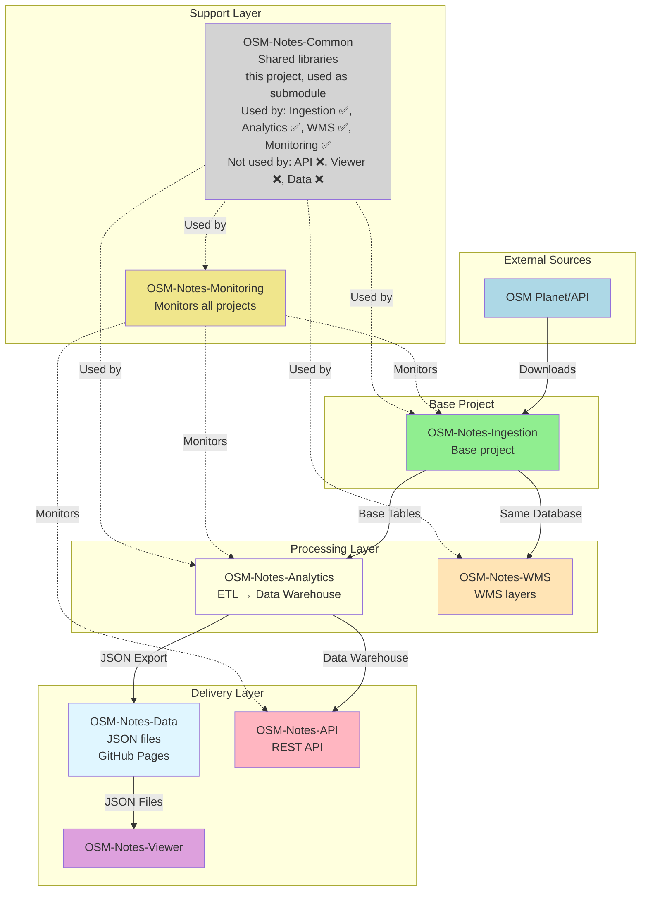

# OSM-Notes-Common

Shared functions and utilities for OSM Notes processing projects.

## Overview

This repository contains common Bash functions and utilities shared between multiple OSM Notes projects
via Git submodule. It provides reusable libraries for logging, validation, error handling, and common
utilities.

## OSM-Notes Ecosystem

This Common library is part of the **OSM-Notes ecosystem**, consisting of 8 interconnected projects.
**OSM-Notes-Ingestion is the base project** - it was the first created and provides the foundation
for all others. **This Common library is used as a Git submodule** by multiple projects in the ecosystem.

### Ecosystem Projects

1. **[OSM-Notes-Ingestion](https://github.com/OSM-Notes/OSM-Notes-Ingestion)** - **Base project**
   - Downloads and synchronizes OSM notes from Planet and API
   - Populates base PostgreSQL tables
   - First project created, foundation for all others
   - **Uses Common**: ✅ Yes (as Git submodule at `lib/osm-common/`)

2. **[OSM-Notes-Analytics](https://github.com/OSM-Notes/OSM-Notes-Analytics)**
   - ETL processes and data warehouse
   - Generates analytics and datamarts
   - **Requires**: OSM-Notes-Ingestion (reads from base tables)
   - **Uses Common**: ✅ Yes (as Git submodule at `lib/osm-common/`)

3. **[OSM-Notes-API](https://github.com/OSM-Notes/OSM-Notes-API)**
   - REST API for programmatic access
   - Provides dynamic queries and advanced features
   - **Requires**: OSM-Notes-Analytics (reads from data warehouse)
   - **Uses Common**: ❌ No (Node.js/TypeScript project, doesn't use Bash libraries)

4. **[OSM-Notes-Viewer](https://github.com/OSM-Notes/OSM-Notes-Viewer)**
   - Web application for interactive visualization
   - Consumes JSON data from OSM-Notes-Data (GitHub Pages)
   - **Requires**: OSM-Notes-Data (which is generated by OSM-Notes-Analytics)
   - **Uses Common**: ❌ No (JavaScript project, doesn't use Bash libraries)

5. **[OSM-Notes-WMS](https://github.com/OSM-Notes/OSM-Notes-WMS)**
   - Web Map Service for geographic visualization
   - Publishes WMS layers for mapping applications
   - **Requires**: OSM-Notes-Ingestion (uses same database)
   - **Uses Common**: ✅ Yes (as Git submodule at `lib/osm-common/`)

6. **[OSM-Notes-Monitoring](https://github.com/OSM-Notes/OSM-Notes-Monitoring)**
   - Centralized monitoring and alerting
   - Monitors all ecosystem components
   - **Requires**: Access to all other projects' databases/services
   - **Uses Common**: ✅ Yes (as Git submodule at `lib/osm-common/`)

7. **[OSM-Notes-Common](https://github.com/OSM-Notes/OSM-Notes-Common)** (this project)
   - Shared Bash libraries and utilities
   - Used as Git submodule by multiple projects
   - **Used by**: Ingestion, Analytics, WMS, Monitoring
   - **Not used by**: API (Node.js), Viewer (JavaScript), Data (no code)

8. **[OSM-Notes-Data](https://github.com/OSM-Notes/OSM-Notes-Data)**
   - JSON data files exported from Analytics
   - Served via GitHub Pages
   - **Requires**: OSM-Notes-Analytics (generates and publishes the data)
   - **Consumed by**: Viewer (primary consumer), API (optional)
   - **Uses Common**: ❌ No (data repository, no code)

### Project Relationships



### Projects Using Common

The following projects use OSM-Notes-Common as a Git submodule:

- ✅ **OSM-Notes-Ingestion**: Uses Common for logging, validation, error handling
- ✅ **OSM-Notes-Analytics**: Uses Common for logging, validation, error handling
- ✅ **OSM-Notes-WMS**: Uses Common for logging, validation, error handling
- ✅ **OSM-Notes-Monitoring**: Uses Common for logging, validation, error handling

The following projects do **not** use Common (different technology stack):

- ❌ **OSM-Notes-API**: Node.js/TypeScript project (uses npm packages instead)
- ❌ **OSM-Notes-Viewer**: JavaScript project (uses npm packages instead)
- ❌ **OSM-Notes-Data**: Data repository (no code, only JSON files)

## Components

### Core Functions

- **`commonFunctions.sh`**: Common utility functions used across all scripts
  - Directory and file management
  - Process management
  - Logging helpers
  - Configuration loading

- **`validationFunctions.sh`**: Validation functions for data integrity
  - XML validation
  - CSV validation
  - Database validation
  - Coordinate validation

- **`consolidatedValidationFunctions.sh`**: Consolidated validation utilities
  - Enhanced XML validation
  - Schema validation
  - Data quality checks

- **`errorHandlingFunctions.sh`**: Error handling and recovery functions
  - Error trapping
  - Cleanup on errors
  - Recovery mechanisms
  - Exit code management

### Libraries

- **`bash_logger.sh`**: Logging library (log4j-style for Bash)
  - Multiple log levels: TRACE, DEBUG, INFO, WARN, ERROR, FATAL
  - Timestamp formatting
  - Colored output
  - File and console logging

## Recommended Reading Path

**New to this project?** Follow this reading path (~30 minutes):

### For Library Users

1. **Start Here** (10 min)
   - Read this README.md (you're here!)
   - Understand what Common provides
   - Review Components section above

2. **Using Common** (15 min)
   - Review "Usage as Git Submodule" section below
   - Review "Using the Functions" examples
   - Understand how to load functions in your scripts

3. **Available Functions** (5 min)
   - Review Components section for available functions
   - Check function documentation in source files

**Total time: ~30 minutes** for basic usage.

### For Contributors

1. **Development** (20 min)
   - Review Development section below
   - Understand versioning strategy
   - Review Testing requirements

2. **Making Changes** (10 min)
   - Follow "Making Changes" workflow
   - Ensure compatibility with dependent projects
   - Submit pull request

**Total time: ~30 minutes** for contributor overview.

## Usage as Git Submodule

This repository is designed to be used as a Git submodule.

### Adding as Submodule

```bash
# In your project directory
git submodule add https://github.com/OSM-Notes/OSM-Notes-Common.git lib/osm-common

# Commit the submodule
git commit -m "Add OSM-Notes-Common as submodule"
```

### Cloning Projects with Submodules

```bash
# Clone with submodules
git clone --recurse-submodules https://github.com/yourorg/yourproject.git

# Or initialize after cloning
git clone https://github.com/yourorg/yourproject.git
cd yourproject
git submodule init
git submodule update
```

### Updating Submodule

```bash
# Update to latest version
git submodule update --remote lib/osm-common

# Commit the update
git add lib/osm-common
git commit -m "Update osm-common submodule"
```

## Using the Functions

### Example 1: Using Common Functions

```bash
#!/bin/bash

# Load common functions from submodule
source "lib/osm-common/commonFunctions.sh"

# Use the functions
__start_logger
logInfo "Processing started"
```

### Example 2: Using Validation Functions

```bash
#!/bin/bash

# Load validation functions
source "lib/osm-common/validationFunctions.sh"

# Validate XML file
if __validate_xml_file "data.xml" "schema.xsd"; then
    echo "XML is valid"
fi
```

### Example 3: Using Logger

```bash
#!/bin/bash

# Load bash logger
source "lib/osm-common/bash_logger.sh"

# Set log level
LOG_LEVEL="DEBUG"

# Use logger
logInfo "Application started"
logDebug "Debug information"
logError "Something went wrong"
```

## Requirements

### Application Requirements

- **Bash** 4.0 or higher
- **Linux** operating system
- **Standard UNIX utilities**: grep, awk, sed, etc.

### Internal Repository Requirements

**None** - This is a shared library used as Git submodule by other projects.

**Used by**:
- OSM-Notes-Ingestion (as submodule)
- OSM-Notes-Analytics (as submodule)
- OSM-Notes-WMS (as submodule)
- OSM-Notes-Monitoring (as submodule)

**Not used by**:
- OSM-Notes-API (Node.js/TypeScript project)
- OSM-Notes-Viewer (JavaScript project)
- OSM-Notes-Data (data repository, no code)

## Version Compatibility

This library requires:

- **Bash** 4.0 or higher
- **Linux** operating system
- Standard UNIX utilities (grep, awk, sed, etc.)

## Development

### Making Changes

1. Create a feature branch
2. Make your changes
3. Test with both dependent projects
4. Submit a pull request

### Testing

Before committing changes, ensure:

- All functions are documented
- No breaking changes to public APIs
- shellcheck passes: `shellcheck -x -o all *.sh`
- shfmt formatting: `shfmt -w -i 1 -sr -bn *.sh`

## Versioning

This project follows [Semantic Versioning](https://semver.org/):

- **Major version**: Breaking changes
- **Minor version**: New features (backward compatible)
- **Patch version**: Bug fixes

## Contributing

See [CONTRIBUTING.md](CONTRIBUTING.md) for contribution guidelines.

## Documentation

### Shared Ecosystem Documentation

This repository also contains shared documentation for the entire OSM Notes ecosystem:

- **[Glosario Global](docs/GLOSSARY.md)** - Complete glossary of terms used across the ecosystem
- **[Guía de Instalación Completa](docs/INSTALLATION.md)** - Step-by-step installation guide for the complete ecosystem
- **[Flujo de Datos End-to-End](docs/DATA_FLOW.md)** - Complete data flow from OSM Planet to Viewer
- **[Guía de Decisión](docs/DECISION_GUIDE.md)** - Help deciding which projects you need

See [docs/README.md](docs/README.md) for complete documentation index.

### Project-Specific Documentation

- [Schemas Documentation](schemas/README.md) - JSON Schema definitions and validation

## License

See [LICENSE](LICENSE) for license information.

## Support

For issues or questions:

- Create an issue in this repository
- Check documentation in dependent projects
- Contact: @angoca in Telegram and several social network

## Related Projects

For complete information about the OSM-Notes ecosystem and all 8 projects, see the
[OSM-Notes Ecosystem](#osm-notes-ecosystem) section above.

**Projects using Common as submodule:**
- [OSM-Notes-Ingestion](https://github.com/OSM-Notes/OSM-Notes-Ingestion) - Notes ingestion ✅
- [OSM-Notes-Analytics](https://github.com/OSM-Notes/OSM-Notes-Analytics) - DWH and analytics ✅
- [OSM-Notes-WMS](https://github.com/OSM-Notes/OSM-Notes-WMS) - WMS service ✅
- [OSM-Notes-Monitoring](https://github.com/OSM-Notes/OSM-Notes-Monitoring) - Monitoring ✅

**Other ecosystem projects:**
- [OSM-Notes-API](https://github.com/OSM-Notes/OSM-Notes-API) - REST API ❌ (doesn't use Common)
- [OSM-Notes-Viewer](https://github.com/OSM-Notes/OSM-Notes-Viewer) - Web visualization ❌ (doesn't use Common)
- [OSM-Notes-Data](https://github.com/OSM-Notes/OSM-Notes-Data) - JSON data files ❌ (no code)

## Acknowledgments

- **Andres Gomez (@AngocA)**: Main developer
- All contributors to the OSM Notes processing ecosystem
