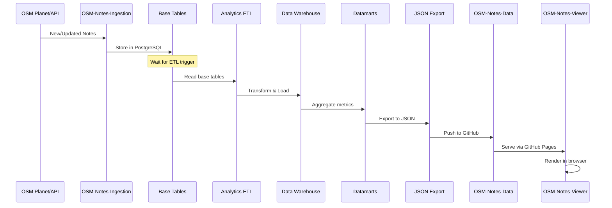

# End-to-End Data Flow of OSM Notes Ecosystem

This document describes the complete data flow from OpenStreetMap to final visualization, including all transformations, formats, and processing times at each stage.

---

## 📊 Complete Flow Diagram

```mermaid
flowchart LR
    subgraph External["External Sources"]
        OSM_API[OSM Notes API<br/>openstreetmap.org]
        PLANET[OSM Planet Dump<br/>planet.openstreetmap.org]
        OVERPASS[Overpass API<br/>overpass-api.de]
    end
    
    subgraph Ingestion["1. Ingestion Layer"]
        INGESTION[OSM-Notes-Ingestion]
        BASE_DB[(PostgreSQL<br/>Database: notes<br/>Schema: public)]
        BASE_TABLES[Base Tables<br/>notes<br/>note_comments<br/>users<br/>countries]
    end
    
    subgraph Processing["2. Processing Layer"]
        ANALYTICS[OSM-Notes-Analytics]
        ETL[ETL Process]
        DWH_DB[(PostgreSQL<br/>Database: osm_notes_dwh<br/>Schema: dwh)]
        STAR_SCHEMA[Star Schema<br/>facts<br/>dimensions]
        DATAMARTS[Datamarts<br/>datamartCountries<br/>datamartUsers<br/>datamartGlobal]
    end
    
    subgraph Export["3. Export Layer"]
        JSON_EXPORT[JSON Export]
        VALIDATION[Schema Validation]
        DATA_REPO[OSM-Notes-Data<br/>GitHub Repository]
        GITHUB_PAGES[GitHub Pages<br/>CDN]
    end
    
    subgraph Delivery["4. Delivery Layer"]
        VIEWER[OSM-Notes-Viewer<br/>Web Application]
        API[OSM-Notes-API<br/>REST API]
        WMS[OSM-Notes-WMS<br/>WMS Service]
    end
    
    subgraph Monitoring["5. Monitoring Layer"]
        MONITORING[OSM-Notes-Monitoring]
        METRICS_DB[(PostgreSQL<br/>Database: osm_notes_monitoring)]
    end
    
    OSM_API -->|XML/JSON<br/>Real-time| INGESTION
    PLANET -->|XML<br/>Daily dump| INGESTION
    OVERPASS -->|GeoJSON<br/>Boundaries| INGESTION
    
    INGESTION -->|Stores| BASE_DB
    BASE_DB -->|Contains| BASE_TABLES
    
    BASE_TABLES -->|Reads| ANALYTICS
    ANALYTICS -->|ETL| ETL
    ETL -->|Writes| DWH_DB
    DWH_DB -->|Contains| STAR_SCHEMA
    STAR_SCHEMA -->|Aggregates| DATAMARTS
    
    DATAMARTS -->|Exports| JSON_EXPORT
    JSON_EXPORT -->|Validates| VALIDATION
    VALIDATION -->|Pushes| DATA_REPO
    DATA_REPO -->|Serves| GITHUB_PAGES
    
    GITHUB_PAGES -->|JSON Files| VIEWER
    DWH_DB -->|Queries| API
    BASE_DB -->|Reads| WMS
    
    MONITORING -.->|Monitors| INGESTION
    MONITORING -.->|Monitors| ANALYTICS
    MONITORING -.->|Monitors| API
    MONITORING -.->|Stores Metrics| METRICS_DB
    
    style OSM_API fill:#ADD8E6
    style PLANET fill:#ADD8E6
    style INGESTION fill:#90EE90
    style BASE_DB fill:#90EE90
    style ANALYTICS fill:#FFFFE0
    style DWH_DB fill:#FFFFE0
    style JSON_EXPORT fill:#E0F6FF
    style DATA_REPO fill:#E0F6FF
    style VIEWER fill:#DDA0DD
    style API fill:#FFB6C1
    style WMS fill:#FFE4B5
    style MONITORING fill:#F0E68C
```



---

## 🔄 Detailed Flow by Stage

### Stage 1: Ingestion (OSM-Notes-Ingestion)

**Source:** OSM Planet/API  
**Destination:** Base Tables (PostgreSQL)

#### Process

1. **Planet Dump Download**
   - **Frequency:** Daily (UTC)
   - **Format:** Compressed XML
   - **Size:** Several hundred MB
   - **Time:** ~1 minute (download)

2. **API Sync**
   - **Frequency:** Every minute (daemon) or 15 min (cron)
   - **Format:** JSON/XML
   - **Time:** < 2 minutes per execution

3. **Processing**
   - XML → CSV conversion
   - Data validation
   - Country assignment
   - **Time:** 5-15 minutes (depends on volume)

4. **Storage**
   - Base tables in `public` schema:
     - `notes` - Main notes
     - `note_comments` - Comments
     - `note_comments_text` - Comment text
     - `users` - Users
     - `countries` - Countries
   - **Insertion time:** 15 minutes (initial load)

#### Data Formats

**Input:**
- XML (Planet dump)
- JSON/XML (API)

**Output:**
- PostgreSQL tables (schema `public`)
- Types: INTEGER, TEXT, TIMESTAMP, GEOMETRY

#### Transformations

- XML parsing → relational structures
- Coordinate validation
- Geographic assignment (country/maritime)
- User normalization

---

### Stage 2: Analytics (OSM-Notes-Analytics)

**Source:** Base Tables  
**Destination:** Data Warehouse + Datamarts

#### ETL Process

1. **Extract**
   - Reads from base tables (`public` schema)
   - **Time:** 5-6 minutes (initial copy)

2. **Transform**
   - Creates star schema
   - Populates dimensions:
     - `dimension_users`
     - `dimension_countries`
     - `dimension_days`
     - `dimension_applications`
     - And other dimensions
   - Transforms to facts
   - **Time:** 12-15 minutes (parallel processing)

3. **Load**
   - Inserts into `dwh.facts` (partitioned by year)
   - Creates indexes and constraints
   - **Time:** 3-4 minutes

4. **Datamarts**
   - Aggregates data by country (`datamartCountries`)
   - Aggregates data by user (`datamartUsers`)
   - Calculates global metrics (`datamartGlobal`)
   - **Time:** 45-60 minutes (incremental: 5-15 min)

#### Data Formats

**Input:**
- PostgreSQL tables (schema `public`)

**Output:**
- PostgreSQL tables (schema `dwh`):
  - `facts` - Fact table (partitioned)
  - `dimension_*` - Dimension tables
  - `datamart*` - Pre-computed datamarts

#### Transformations

- Data normalization
- Enrichment with dimensions
- Aggregated metrics calculation
- Automation detection
- User experience classification

#### Processing Times

| Operation | Initial Time | Incremental Time |
|-----------|--------------|------------------|
| Complete ETL | 25-30 min | 5-15 min |
| Datamart Countries | 30-40 min | 1-3 min |
| Datamart Users | 15-20 min | 5-10 min |
| **Total** | **~1-1.5 hours** | **15-30 min** |

---

### Stage 3: Export (OSM-Notes-Analytics → OSM-Notes-Data)

**Source:** Datamarts  
**Destination:** JSON Files (GitHub Pages)

#### Process

1. **Export**
   - Reads from `datamartCountries` and `datamartUsers`
   - Converts to JSON
   - **Time:** 5-10 minutes

2. **Validation**
   - Validates against JSON Schemas
   - Verifies integrity
   - **Time:** 1-2 minutes

3. **Publication**
   - Push to OSM-Notes-Data repository
   - GitHub Pages updates automatically
   - **Time:** 1-2 minutes

#### Data Formats

**Input:**
- PostgreSQL datamarts

**Output:**
- JSON files:
  - `data/users/{hex1}/{hex2}/{hex3}/{user_id}.json`
  - `data/countries/{country_id}.json`
  - `data/indexes/users.json`
  - `data/indexes/countries.json`
  - `data/metadata.json`

#### JSON Structure

**User Profile:**
```json
{
  "user_id": 12345,
  "username": "AngocA",
  "metrics": {
    "history_whole_open": 150,
    "history_whole_closed": 120,
    ...
  }
}
```

**Country Profile:**
```json
{
  "country_id": 42,
  "country_name_en": "Colombia",
  "metrics": {
    "history_whole_open": 5000,
    "history_whole_closed": 4500,
    ...
  }
}
```

---

### Stage 4: Delivery (Data Consumption)

#### 4.1 OSM-Notes-Viewer

**Source:** OSM-Notes-Data (GitHub Pages)  
**Destination:** Web browser

**Process:**
1. Viewer loads `indexes/users.json` and `indexes/countries.json`
2. User selects profile
3. Viewer loads specific JSON: `data/users/.../{user_id}.json`
4. Renders visualizations in browser

**Format:**
- Input: JSON (HTTP)
- Output: HTML/CSS/JavaScript

**Time:**
- Initial load: < 2 seconds
- Profile load: < 1 second

#### 4.2 OSM-Notes-API

**Source:** Data Warehouse (direct)  
**Destination:** HTTP client

**Process:**
1. Client makes HTTP request
2. API queries `dwh` schema
3. API applies filters and transformations
4. API returns JSON

**Format:**
- Input: HTTP requests
- Output: JSON (REST API)

**Time:**
- Simple queries: < 500ms (P95)
- Complex analytics: < 2000ms (P95)

#### 4.3 OSM-Notes-WMS

**Source:** Base Tables (same DB as Ingestion)  
**Destination:** WMS client (JOSM, Vespucci)

**Process:**
1. WMS client makes GetMap request
2. GeoServer queries `wms.notes_wms`
3. GeoServer renders tiles
4. Returns image (PNG/JPEG)

**Format:**
- Input: WMS requests (OGC)
- Output: Map tiles (images)

**Time:**
- Tile generation: < 1 second

---

## ⏱️ Total Processing Times

### Complete Initial Load

| Stage | Time | Description |
|-------|------|-------------|
| Ingestion - Planet | 1 min | Download |
| Ingestion - Processing | 5 min | XML → CSV |
| Ingestion - Insertion | 15 min | Base tables |
| Ingestion - Country assignment | 3 hours | Parallel processing |
| Analytics - ETL | 25-30 min | Complete ETL |
| Analytics - Datamarts | 45-60 min | Aggregations |
| Analytics - JSON Export | 5-10 min | Export |
| **Total** | **~4-5 hours** | First load |

### Incremental Update

| Stage | Time | Frequency |
|-------|------|-----------|
| Ingestion - API Sync | < 2 min | Every minute |
| Analytics - ETL | 5-15 min | Every hour |
| Analytics - Datamarts | 5-15 min | Daily |
| Analytics - Export | 5-10 min | Every 15 min |
| **Total latency** | **~15-30 min** | From OSM to Viewer |

---

## 🔄 Real-Time Data Flow



---

## 📊 Transformations by Stage

### Transformation 1: XML → Relational (Ingestion)

**Input (XML):**
```xml
<note id="12345" lat="4.6097" lon="-74.0817">
  <date>2025-01-25T10:00:00Z</date>
  <user>AngocA</user>
  <comment>Missing road</comment>
</note>
```

**Output (PostgreSQL):**
```sql
INSERT INTO notes (note_id, latitude, longitude, created_at, user_id)
VALUES (12345, 4.6097, -74.0817, '2025-01-25 10:00:00', 123);
```

### Transformation 2: Relational → Star Schema (Analytics)

**Input (Base Tables):**
```sql
SELECT note_id, user_id, created_at, id_country 
FROM notes;
```

**Output (Star Schema):**
```sql
-- Fact table
INSERT INTO dwh.facts (
  fact_id,
  dimension_id_user,
  dimension_id_country,
  dimension_id_day,
  action_at
) VALUES (...);

-- Dimension tables
INSERT INTO dwh.dimension_users (dimension_user_id, username, ...);
INSERT INTO dwh.dimension_countries (dimension_country_id, country_name_en, ...);
```

### Transformation 3: Star Schema → Datamarts (Analytics)

**Input (Facts + Dimensions):**
```sql
SELECT COUNT(*) 
FROM dwh.facts f
JOIN dwh.dimension_countries c ON f.dimension_id_country = c.dimension_country_id
WHERE c.country_name_en = 'Colombia';
```

**Output (Datamart):**
```sql
UPDATE dwh.datamartcountries 
SET history_whole_open = 5000
WHERE country_id = 42;
```

### Transformation 4: Datamarts → JSON (Export)

**Input (PostgreSQL):**
```sql
SELECT * FROM dwh.datamartusers WHERE user_id = 12345;
```

**Output (JSON):**
```json
{
  "user_id": 12345,
  "username": "AngocA",
  "metrics": {
    "history_whole_open": 150,
    "history_whole_closed": 120
  }
}
```

---

## 🔍 Verification Points

### Verification 1: Post-Ingestion

```bash
# Verify data in base tables
psql -d notes -c "SELECT COUNT(*) FROM notes;"  # Must be > 0
psql -d notes -c "SELECT MAX(created_at) FROM notes;"  # Recent timestamp
```

### Verification 2: Post-Analytics

```bash
# Verify data warehouse
psql -d osm_notes_dwh -c "SELECT COUNT(*) FROM dwh.facts;"  # Must be > 0
psql -d osm_notes_dwh -c "SELECT COUNT(*) FROM dwh.datamartcountries;"  # Must be > 0
```

### Verification 3: Post-Export

```bash
# Verify JSON files
curl -s https://osm-notes.github.io/OSM-Notes-Data/data/metadata.json | jq .export_timestamp
curl -s https://osm-notes.github.io/OSM-Notes-Data/data/indexes/users.json | jq 'length'
```

### Verification 4: Post-Delivery

```bash
# Verify Viewer
curl -s https://notes.osm.lat/ | grep -i "osm notes"

# Verify API
curl -H "User-Agent: Test/1.0" http://localhost:3000/health
```

---

## 📈 Data Volumes

### Typical Data (Production)

| Stage | Volume | Example |
|-------|--------|---------|
| OSM Planet | ~500 MB (compressed) | All historical data |
| Base Tables | ~50-100 GB | 5-6 million notes |
| Data Warehouse | ~100-200 GB | Facts + Dimensions |
| Datamarts | ~500 MB | Aggregations |
| JSON Export | ~100-200 MB | JSON files |
| GitHub Pages | ~100-200 MB | Static files |

---

## 🔗 Cross References

- [Complete Installation Guide](./INSTALLATION.md) - Step-by-step installation
- [Global Glossary](./GLOSSARY.md) - Terms and definitions
- [OSM-Notes-Ingestion Process API](https://github.com/OSM-Notes/OSM-Notes-Ingestion/blob/main/docs/Process_API.md)
- [OSM-Notes-Analytics ETL](https://github.com/OSM-Notes/OSM-Notes-Analytics/blob/main/docs/ETL_Enhanced_Features.md)
- [OSM-Notes-Analytics Data Flow](https://github.com/OSM-Notes/OSM-Notes-Analytics/blob/main/docs/Data_Flow_Diagrams.md)

---

**Last updated:** 2026-01-25  
**Maintained by:** OSM Notes Community
