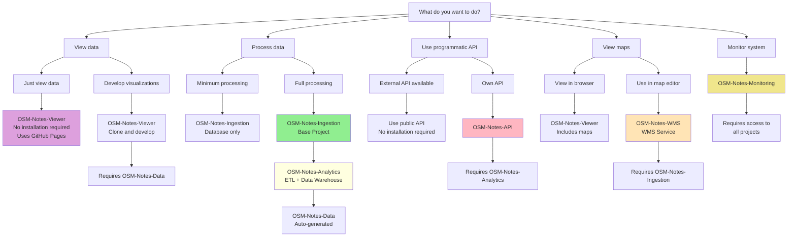
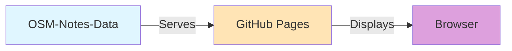
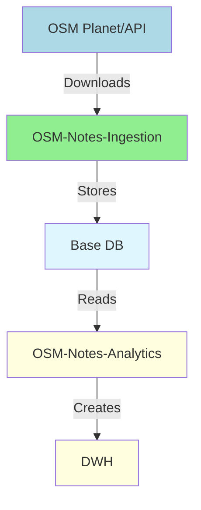
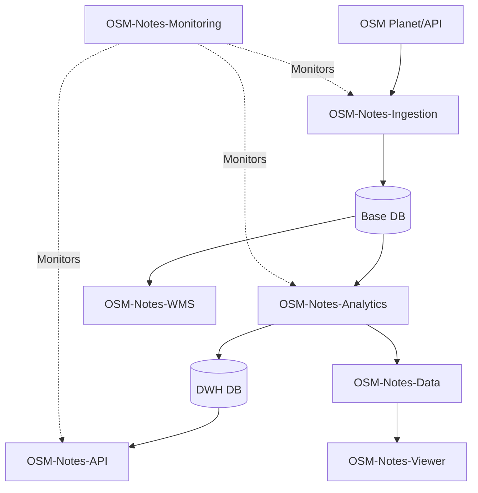

# Decision Guide - Which Project Do I Need?

This guide helps you decide which OSM Notes ecosystem projects you need to install based on your use case.

---

## 🎯 Decision Diagram

---

## 📋 Common Use Cases

### Case 1: "I just want to view data" 👀

**You need:** Nothing (or just a browser)

**Solution:**
- Visit [notes.osm.lat](https://notes.osm.lat/) directly
- No installation required
- Data updates automatically

**Required projects:** None

**Setup time:** 0 minutes

---

### Case 2: "I want to process OSM data" 🔄

**You need:** Ingestion + Analytics

**Minimum solution:**
- **OSM-Notes-Ingestion** - Downloads and stores data
- Database with raw data

**Complete solution:**
- **OSM-Notes-Ingestion** - Base project
- **OSM-Notes-Analytics** - ETL and data warehouse
- **OSM-Notes-Data** - Auto-generated by Analytics

**Required projects:**
1. OSM-Notes-Ingestion ⭐ (required)
2. OSM-Notes-Analytics (optional but recommended)

**Setup time:** 2-4 hours

---

### Case 3: "I want a programmatic API" 🔌

**You need:** Analytics + API

**Option A - External API:**
- Use public API (if available)
- No installation required

**Option B - Own API:**
- **OSM-Notes-Ingestion** ⭐ (base)
- **OSM-Notes-Analytics** (required - API reads from DWH)
- **OSM-Notes-API** (this project)

**Required projects:**
1. OSM-Notes-Ingestion ⭐
2. OSM-Notes-Analytics
3. OSM-Notes-API

**Setup time:** 3-5 hours

---

### Case 4: "I want maps in JOSM/Vespucci" 🗺️

**You need:** Ingestion + WMS

**Solution:**
- **OSM-Notes-Ingestion** ⭐ (required - same DB)
- **OSM-Notes-WMS** - WMS Service

**Required projects:**
1. OSM-Notes-Ingestion ⭐
2. OSM-Notes-WMS

**Setup time:** 1-2 hours

---

### Case 5: "I want to monitor everything" 📊

**You need:** All projects + Monitoring

**Solution:**
- Install all projects first
- **OSM-Notes-Monitoring** at the end

**Required projects:**
1. OSM-Notes-Ingestion ⭐
2. OSM-Notes-Analytics
3. OSM-Notes-WMS
4. OSM-Notes-Data (auto-generated)
5. OSM-Notes-API
6. OSM-Notes-Viewer (can optionally use API for enhanced features)
7. OSM-Notes-Monitoring

**Setup time:** 4-6 hours

---

### Case 6: "I want to develop visualizations" 💻

**You need:** Data + Viewer

**Solution:**
- **OSM-Notes-Data** - JSON data (can use public GitHub Pages)
- **OSM-Notes-Viewer** - Clone and develop

**Required projects:**
1. OSM-Notes-Viewer (clone)
2. OSM-Notes-Data (can use public or generate own)

**Setup time:** 15-30 minutes

---

## 🏗️ Recommended Architectures

### Minimum Architecture

**For:** View data only

**Projects:** None (uses public data)

---

### Basic Architecture

**For:** Process data locally

**Projects:**
- OSM-Notes-Ingestion ⭐
- OSM-Notes-Analytics

**Resources:**
- 1 PostgreSQL server
- 4GB RAM minimum
- 100GB disk

---

### Complete Architecture

**For:** Complete ecosystem with all functionality

**Projects:** All 8 projects

**Resources:**
- 2-3 PostgreSQL servers (or 1 large)
- 8GB RAM minimum
- 500GB disk
- GeoServer (for WMS)
- Node.js (for API)

---

## 📊 Architecture Comparison

| Architecture | Projects | Setup Time | Resources | Use Case |
|--------------|----------|------------|-----------|----------|
| **Minimum** | 0 | 0 min | Browser | Just view data |
| **Basic** | 2 | 2-4 hours | 4GB RAM, 100GB | Process data |
| **API** | 3 | 3-5 hours | 4GB RAM, 100GB | Programmatic API |
| **WMS** | 2 | 1-2 hours | 4GB RAM, 100GB | Maps in editors |
| **Complete** | 8 | 4-6 hours | 8GB RAM, 500GB | Complete ecosystem |

---

## ❓ Frequently Asked Questions

### Can I install only Analytics without Ingestion?

**No.** Analytics requires the base tables created by Ingestion. You must install Ingestion first.

### Can I use Viewer without installing anything?

**Yes.** Viewer consumes data from GitHub Pages. You can use it directly at [notes.osm.lat](https://notes.osm.lat/).

### Do I need to install Data manually?

**No.** Data is automatically generated by Analytics when you run `exportAndPushJSONToGitHub.sh`.

### Can I use API without Analytics?

**No.** API reads directly from Analytics' data warehouse. You need Analytics installed.

### Does WMS need its own database?

**No.** WMS uses the same database as Ingestion (schema `public`). It only creates its own `wms` schema.

### Can Monitoring be installed alone?

**No.** Monitoring needs access to all projects to monitor them. Install it at the end.

---

## 🎯 Recommendations by Profile

### Profile: End User
- **You need:** Viewer only
- **Installation:** None (use web)
- **Time:** 0 minutes

### Profile: Frontend Developer
- **You need:** Viewer (clone for development)
- **Installation:** Clone repo, `npm install`
- **Time:** 15 minutes

### Profile: Data Engineer
- **You need:** Ingestion + Analytics
- **Installation:** Complete (see [Installation Guide](./Installation.md))
- **Time:** 2-4 hours

### Profile: Backend Developer
- **You need:** Ingestion + Analytics + API
- **Installation:** Complete + API
- **Time:** 3-5 hours

### Profile: Mapper (JOSM/Vespucci)
- **You need:** Ingestion + WMS
- **Installation:** Ingestion + WMS
- **Time:** 1-2 hours

### Profile: System Administrator
- **You need:** All projects
- **Installation:** Complete (see [Installation Guide](./Installation.md))
- **Time:** 4-6 hours

---

## 🔗 References

- [Complete Installation Guide](./Installation.md) - Step-by-step installation
- [Data Flow](./Data_Flow.md) - Understand the complete flow
- [Global Glossary](./Glossary.md) - Terms and definitions
- [OSM Notes Ecosystem](https://github.com/OSM-Notes/OSM-Notes) - Landing page

---

**Last updated:** 2026-01-25  
**Maintained by:** OSM Notes Community
