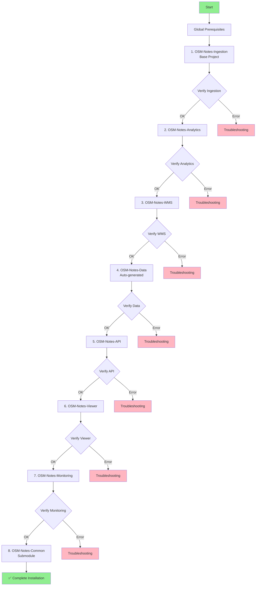

# Complete Installation Guide for OSM Notes Ecosystem

This guide walks you step-by-step through the complete installation of all 8 projects in the OSM Notes ecosystem.

---

## 📋 Table of Contents

1. [Global Prerequisites](#global-prerequisites)
2. [Installation Order](#installation-order)
3. [Step-by-Step Installation](#step-by-step-installation)
4. [Post-Installation Verification](#post-installation-verification)
5. [Common Troubleshooting](#common-troubleshooting)
6. [Production Configuration](#production-configuration)

---

## Global Prerequisites

### Operating System

- **Linux** (Ubuntu/Debian recommended)
- **Bash** 4.0 or higher
- **Git** to clone repositories

### Base Software

```bash
# PostgreSQL with PostGIS
sudo apt-get install postgresql postgresql-contrib postgis

# Basic tools
sudo apt-get install curl jq parallel

# Node.js (for API and Viewer)
curl -fsSL https://deb.nodesource.com/setup_18.x | sudo -E bash -
sudo apt-get install -y nodejs

# Java (for GeoServer/WMS)
sudo apt-get install default-jre
```

### Required Databases

The ecosystem uses multiple PostgreSQL databases:

- **`notes`** - Main database (Ingestion)
- **`osm_notes_dwh`** or **`notes_dwh`** - Data warehouse (Analytics)
- **`osm_notes_monitoring`** or **`notes_monitoring`** - Monitoring (Monitoring)

---

## Installation Order



**Critical order:**
1. **OSM-Notes-Ingestion** - MUST be installed first (base project)
2. **OSM-Notes-Analytics** - Requires Ingestion
3. **OSM-Notes-WMS** - Requires Ingestion
4. **OSM-Notes-Data** - Auto-generated by Analytics
5. **OSM-Notes-API** - Requires Analytics (no dependency on Viewer)
6. **OSM-Notes-Viewer** - Requires Data (can optionally use API for enhanced features)
7. **OSM-Notes-Monitoring** - Requires all others
8. **OSM-Notes-Common** - Submodule (no installation required)

---

## Step-by-Step Installation

### Step 0: Preparation

```bash
# Create working directory
mkdir -p ~/github/OSM-Notes
cd ~/github/OSM-Notes

# Configure PostgreSQL
sudo systemctl start postgresql
sudo systemctl enable postgresql
```

---

### Step 1: OSM-Notes-Ingestion ⭐ BASE PROJECT

**Estimated time:** 30-60 minutes (first execution)

#### 1.1 Clone Repository

```bash
git clone --recurse-submodules https://github.com/OSM-Notes/OSM-Notes-Ingestion.git
cd OSM-Notes-Ingestion
```

#### 1.2 Configure Database

```bash
# Create database
sudo -u postgres psql << EOF
CREATE USER notes SUPERUSER;
CREATE DATABASE notes WITH OWNER notes;
\c notes
CREATE EXTENSION postgis;
CREATE EXTENSION btree_gist;
EOF
```

#### 1.3 Configure Properties

```bash
cp etc/properties.sh.example etc/properties.sh
nano etc/properties.sh  # Edit with your credentials
```

#### 1.4 Install Directories (Production)

```bash
sudo bin/scripts/install_directories.sh
```

#### 1.5 Run Initial Installation

```bash
# The daemon handles initial installation automatically
sudo cp examples/systemd/osm-notes-ingestion-daemon.service /etc/systemd/system/
sudo systemctl daemon-reload
sudo systemctl enable osm-notes-ingestion-daemon
sudo systemctl start osm-notes-ingestion-daemon
```

**Or alternatively with cron:**
```bash
# First manual execution for initial load
./bin/process/processAPINotes.sh
```

#### 1.6 Verification

```bash
# Verify that base tables exist
psql -d notes -c "SELECT COUNT(*) FROM notes;"
psql -d notes -c "SELECT COUNT(*) FROM note_comments;"
psql -d notes -c "SELECT COUNT(*) FROM users;"
psql -d notes -c "SELECT COUNT(*) FROM countries;"

# Verify daemon logs
sudo journalctl -u osm-notes-ingestion-daemon -f
```

**✅ Ready when:** All tables have data (> 0 records)

**References:**
- [OSM-Notes-Ingestion README](https://github.com/OSM-Notes/OSM-Notes-Ingestion/blob/main/README.md)
- [Process API Documentation](https://github.com/OSM-Notes/OSM-Notes-Ingestion/blob/main/docs/Process_API.md)

---

### Step 2: OSM-Notes-Analytics

**Estimated time:** 1-2 hours (initial ETL)

#### 2.1 Clone Repository

```bash
cd ~/github/OSM-Notes
git clone --recurse-submodules https://github.com/OSM-Notes/OSM-Notes-Analytics.git
cd OSM-Notes-Analytics
```

#### 2.2 Configure Database

```bash
# Create database (can be same as Ingestion or separate)
sudo -u postgres psql << EOF
CREATE DATABASE osm_notes_dwh WITH OWNER notes;
\c osm_notes_dwh
CREATE EXTENSION postgis;
EOF
```

#### 2.3 Configure Properties

```bash
cp etc/properties.sh.example etc/properties.sh
nano etc/properties.sh  # Configure DBNAME=osm_notes_dwh
```

#### 2.4 Run Initial ETL

```bash
cd bin/dwh
./ETL.sh
```

**Estimated time:** 25-30 minutes for initial ETL (depends on data volume)

#### 2.5 Verification

```bash
# Verify that dwh schema exists
psql -d osm_notes_dwh -c "SELECT schema_name FROM information_schema.schemata WHERE schema_name = 'dwh';"

# Verify main tables
psql -d osm_notes_dwh -c "SELECT COUNT(*) FROM dwh.facts;"
psql -d osm_notes_dwh -c "SELECT COUNT(*) FROM dwh.datamartcountries;"
psql -d osm_notes_dwh -c "SELECT COUNT(*) FROM dwh.datamartusers;"
```

**✅ Ready when:** 
- `dwh` schema exists
- `facts` table has data
- Datamarts have data

**References:**
- [OSM-Notes-Analytics README](https://github.com/OSM-Notes/OSM-Notes-Analytics/blob/main/README.md)
- [ETL Enhanced Features](https://github.com/OSM-Notes/OSM-Notes-Analytics/blob/main/docs/ETL_Enhanced_Features.md)

---

### Step 3: OSM-Notes-WMS

**Estimated time:** 30-45 minutes

#### 3.1 Clone Repository

```bash
cd ~/github/OSM-Notes
git clone --recurse-submodules https://github.com/OSM-Notes/OSM-Notes-WMS.git
cd OSM-Notes-WMS
```

#### 3.2 Install GeoServer

```bash
# Option A: Docker (recommended)
docker run -d -p 8080:8080 \
  -e GEOSERVER_DATA_DIR=/opt/geoserver/data_dir \
  -v geoserver_data:/opt/geoserver/data_dir \
  kartoza/geoserver:latest

# Option B: Manual installation
# Download from https://geoserver.org/download/
```

#### 3.3 Configure Properties

```bash
cp etc/wms.properties.sh.example etc/wms.properties.sh
nano etc/wms.properties.sh  # Configure database and GeoServer
```

#### 3.4 Install WMS Components

```bash
./bin/wms/wmsManager.sh install
```

#### 3.5 Configure GeoServer

```bash
./bin/wms/geoserverConfig.sh install
```

#### 3.6 Verification

```bash
# Verify WMS schema
psql -d notes -c "SELECT COUNT(*) FROM wms.notes_wms;"

# Verify GeoServer
curl http://localhost:8080/geoserver/wms?SERVICE=WMS&VERSION=1.3.0&REQUEST=GetCapabilities | grep -i "notes"
```

**✅ Ready when:**
- `wms` schema exists
- GeoServer responds with note layers

**References:**
- [OSM-Notes-WMS README](https://github.com/OSM-Notes/OSM-Notes-WMS/blob/main/README.md)
- [WMS Guide](https://github.com/OSM-Notes/OSM-Notes-WMS/blob/main/docs/WMS_Guide.md)

---

### Step 4: OSM-Notes-Data

**Estimated time:** 5-10 minutes (auto-generated)

#### 4.1 Export Data from Analytics

```bash
cd ~/github/OSM-Notes/OSM-Notes-Analytics
./bin/dwh/exportAndPushJSONToGitHub.sh
```

This script:
- Exports datamarts to JSON
- Validates against schemas
- Pushes to OSM-Notes-Data repository
- GitHub Pages updates automatically

#### 4.2 Verification

```bash
# Verify that JSON files exist in repository
# Or visit: https://osm-notes.github.io/OSM-Notes-Data/data/metadata.json
curl https://osm-notes.github.io/OSM-Notes-Data/data/metadata.json
```

**✅ Ready when:** metadata.json is accessible and has recent timestamp

**References:**
- [OSM-Notes-Data README](https://github.com/OSM-Notes/OSM-Notes-Data/blob/main/README.md)

---

### Step 5: OSM-Notes-API

**Estimated time:** 20-30 minutes

#### 5.1 Clone Repository

```bash
cd ~/github/OSM-Notes
git clone https://github.com/OSM-Notes/OSM-Notes-API.git
cd OSM-Notes-API
```

#### 5.2 Install Dependencies

```bash
npm install
```

#### 5.3 Configure Environment Variables

```bash
cp .env.example .env
nano .env  # Configure Analytics database
```

#### 5.4 Create Database User (Read-Only)

```bash
# Create read-only user for API
psql -d osm_notes_dwh << EOF
CREATE USER api_user WITH PASSWORD 'your_secure_password';
GRANT USAGE ON SCHEMA dwh TO api_user;
GRANT SELECT ON ALL TABLES IN SCHEMA dwh TO api_user;
ALTER DEFAULT PRIVILEGES IN SCHEMA dwh GRANT SELECT ON TABLES TO api_user;
EOF
```

#### 5.5 Compile TypeScript

```bash
npm run build
```

#### 5.6 Start Server

```bash
# Development
npm run dev

# Production
npm start
```

#### 5.7 Verification

```bash
# Health check
curl -H "User-Agent: TestApp/1.0 (test@example.com)" http://localhost:3000/health

# Test endpoint
curl -H "User-Agent: TestApp/1.0 (test@example.com)" http://localhost:3000/api/v1/analytics/global
```

**✅ Ready when:** Health check returns OK and endpoints respond

**References:**
- [OSM-Notes-API README](https://github.com/OSM-Notes/OSM-Notes-API/blob/main/README.md)
- [Installation Guide](https://github.com/OSM-Notes/OSM-Notes-API/blob/main/docs/INSTALLATION.md)
- [API Reference](https://github.com/OSM-Notes/OSM-Notes-API/blob/main/docs/API.md)

---

### Step 6: OSM-Notes-Viewer

**Estimated time:** 15-20 minutes

#### 6.1 Clone Repository

```bash
cd ~/github/OSM-Notes
git clone --recurse-submodules https://github.com/OSM-Notes/OSM-Notes-Viewer.git
cd OSM-Notes-Viewer
```

#### 6.2 Install Dependencies (Optional, for development)

```bash
npm install
```

#### 6.3 Configure API Endpoint (Optional)

```bash
# Edit config/api-config.js if you want Viewer to use API for enhanced features
# Default uses: https://osm-notes.github.io/OSM-Notes-Data/
# If API is available, you can configure it here for real-time data and advanced queries
```

**Note:** Viewer can work without API (uses static JSON from Data). API is optional and provides enhanced features like real-time data and advanced queries.

#### 6.4 Serve Locally (Development)

```bash
# Option 1: Vite (recommended)
npm run dev

# Option 2: Python
python3 -m http.server 8000

# Option 3: Node.js http-server
npx http-server src -p 8000
```

#### 6.5 Deploy to GitHub Pages (Production)

```bash
# Project has GitHub Actions configured
# Just push to main branch
git push origin main
```

#### 6.6 Verification

```bash
# Open in browser
# Local: http://localhost:8000/src/index.html
# Production: https://notes.osm.lat/
```

**✅ Ready when:** Viewer loads and displays data

**References:**
- [OSM-Notes-Viewer README](https://github.com/OSM-Notes/OSM-Notes-Viewer/blob/main/README.md)
- [Architecture Documentation](https://github.com/OSM-Notes/OSM-Notes-Viewer/blob/main/docs/ARCHITECTURE.md)

---

### Step 7: OSM-Notes-Monitoring

**Estimated time:** 30-45 minutes

#### 7.1 Clone Repository

```bash
cd ~/github/OSM-Notes
git clone --recurse-submodules https://github.com/OSM-Notes/OSM-Notes-Monitoring.git
cd OSM-Notes-Monitoring
```

#### 7.2 Create Monitoring Database

```bash
sudo -u postgres psql << EOF
CREATE DATABASE osm_notes_monitoring WITH OWNER notes;
\c osm_notes_monitoring
EOF
```

#### 7.3 Initialize Database

```bash
psql -d osm_notes_monitoring -f sql/init.sql

# Grant permissions
psql -d osm_notes_monitoring << EOF
GRANT SELECT, INSERT, UPDATE ON ALL TABLES IN SCHEMA public TO notes;
GRANT USAGE, SELECT ON ALL SEQUENCES IN SCHEMA public TO notes;
EOF
```

#### 7.4 Configure Properties

```bash
cp etc/properties.sh.example etc/properties.sh
nano etc/properties.sh  # Configure access to all databases
```

#### 7.5 Configure Alerts

```bash
cp config/alerts.conf.example config/alerts.conf
nano config/alerts.conf  # Configure emails, Slack, etc.
```

#### 7.6 Run Initial Monitoring

```bash
# Monitor Ingestion
./bin/monitor/monitorIngestion.sh

# Monitor Analytics
./bin/monitor/monitorAnalytics.sh

# Monitor API
./bin/monitor/monitorAPI.sh
```

#### 7.7 Verification

```bash
# Verify metrics in database
psql -d osm_notes_monitoring -c "SELECT * FROM metrics ORDER BY collected_at DESC LIMIT 10;"
```

**✅ Ready when:** Metrics are being collected

**References:**
- [OSM-Notes-Monitoring README](https://github.com/OSM-Notes/OSM-Notes-Monitoring/blob/main/README.md)
- [Quick Start Guide](https://github.com/OSM-Notes/OSM-Notes-Monitoring/blob/main/docs/QUICK_START_GUIDE.md)

---

### Step 8: OSM-Notes-Common

**Estimated time:** 0 minutes (submodule)

#### 8.1 Initialize Submodule

```bash
# Already initialized automatically with --recurse-submodules
# If not, run:
cd ~/github/OSM-Notes/OSM-Notes-Ingestion  # or any project that uses Common
git submodule update --init --recursive
```

#### 8.2 Verification

```bash
# Verify that Common exists
ls -la lib/osm-common/commonFunctions.sh
```

**✅ Ready when:** Common files are present in `lib/osm-common/`

**References:**
- [OSM-Notes-Common README](https://github.com/OSM-Notes/OSM-Notes-Common/blob/main/README.md)

---

## Post-Installation Verification

### Complete Ecosystem Verification

```bash
# 1. Verify Ingestion
psql -d notes -c "SELECT COUNT(*) FROM notes;"  # Must be > 0

# 2. Verify Analytics
psql -d osm_notes_dwh -c "SELECT COUNT(*) FROM dwh.facts;"  # Must be > 0

# 3. Verify WMS
psql -d notes -c "SELECT COUNT(*) FROM wms.notes_wms;"  # Must be > 0

# 4. Verify Data
curl -s https://osm-notes.github.io/OSM-Notes-Data/data/metadata.json | jq .export_timestamp

# 5. Verify API
curl -H "User-Agent: Test/1.0 (test@example.com)" http://localhost:3000/health

# 6. Verify Viewer
curl -s https://notes.osm.lat/ | grep -i "osm notes"

# 7. Verify Monitoring
psql -d osm_notes_monitoring -c "SELECT COUNT(*) FROM metrics;"  # Must be > 0
```

---

## Common Troubleshooting

### Problem: "Schema 'dwh' does not exist"

**Cause:** Analytics did not run correctly

**Solution:**
```bash
cd OSM-Notes-Analytics
./bin/dwh/ETL.sh
```

---

### Problem: "Base tables do not exist"

**Cause:** Ingestion did not run correctly

**Solution:**
```bash
cd OSM-Notes-Ingestion
./bin/process/processAPINotes.sh
```

---

### Problem: "Cannot connect to database"

**Cause:** PostgreSQL is not running or incorrect credentials

**Solution:**
```bash
# Verify PostgreSQL
sudo systemctl status postgresql

# Verify credentials in etc/properties.sh
psql -d notes -U notes -c "SELECT 1;"
```

---

### Problem: "Submodule not initialized"

**Cause:** Submodule was not initialized

**Solution:**
```bash
git submodule update --init --recursive
```

---

### Problem: "ETL takes too long"

**Cause:** Data too large or insufficient resources

**Solution:**
- Increase `ETL_MAX_PARALLEL_JOBS` in `etc/etl.properties`
- Verify system resources (CPU, RAM, disk)

---

## Production Configuration

### Recommended Cron Jobs

```bash
# Ingestion - Daemon mode (recommended) or every 15 min
*/15 * * * * ~/OSM-Notes-Ingestion/bin/process/processAPINotes.sh

# Analytics ETL - Every hour
0 * * * * ~/OSM-Notes-Analytics/bin/dwh/ETL.sh

# Datamarts - Daily
0 2 * * * ~/OSM-Notes-Analytics/bin/dwh/datamartCountries/datamartCountries.sh
30 2 * * * ~/OSM-Notes-Analytics/bin/dwh/datamartUsers/datamartUsers.sh

# Export JSON - Every 15 minutes (after datamarts)
45 2 * * * ~/OSM-Notes-Analytics/bin/dwh/exportAndPushJSONToGitHub.sh

# Monitoring - Every 5 minutes
*/5 * * * * ~/OSM-Notes-Monitoring/bin/monitor/monitorIngestion.sh
*/5 * * * * ~/OSM-Notes-Monitoring/bin/monitor/monitorAnalytics.sh
```

### Systemd Services

```bash
# Ingestion daemon (already configured in Step 1)
sudo systemctl status osm-notes-ingestion-daemon

# API (if using PM2)
pm2 start npm --name "osm-notes-api" -- start
pm2 save
pm2 startup
```

---

## Total Estimated Times

| Scenario | Total Time |
|----------|------------|
| Minimum installation (Ingestion only) | 30-60 min |
| Basic installation (Ingestion + Analytics) | 2-3 hours |
| Complete installation (all projects) | 4-6 hours |
| First historical data load | +3-4 hours |

---

## References

- [OSM Notes Ecosystem](https://github.com/OSM-Notes/OSM-Notes) - Landing page
- [Global Glossary](./GLOSSARY.md) - Terms and definitions
- [Data Flow](./DATA_FLOW.md) - End-to-end flow
- [Decision Guide](./DECISION_GUIDE.md) - Which project do I need?

---

**Last updated:** 2026-01-25  
**Maintained by:** OSM Notes Community
