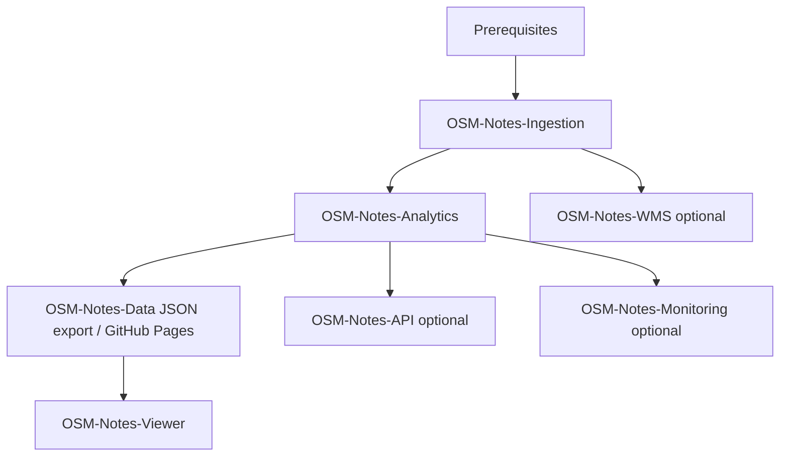

# OSM Notes ecosystem — Installation index

**OSM-Notes-Common** is a **shared library submodule** (`lib/osm-common` in clones of Ingestion,
Analytics, and other repos). There is nothing to “install” for Common except `git submodule update
--init --recursive`.

**Detailed installation procedures belong in each product repository.** Duplicating them here drifts
out of date quickly. Follow the links below for the manuals that authors maintain alongside the code.

---

## Table of contents

1. [Global prerequisites](#global-prerequisites)
2. [Suggested installation order](#suggested-installation-order)
3. [Authoritative documentation by project](#authoritative-documentation-by-project)
4. [Post-install sanity checks](#post-install-sanity-checks)
5. [Related ecosystem docs](#related-ecosystem-docs)

---

## Global prerequisites

Rough baseline (adapt to your distribution and security policy):

- Linux server (Ubuntu/Debian commonly used), **bash**, **Git**
- **PostgreSQL** + **PostGIS** for Ingestion and Analytics (names may vary: `notes`, `notes_dwh`, …)
- **Node.js** where you run API or Viewer builds
- **Java** only if you deploy GeoServer for WMS  
  Concrete packages and roles are spelled out in each project’s README or install guide above.

---

## Suggested installation order



**Important:**

1. **Ingestion first** — populates base tables Analytics needs.
2. **Analytics second** — builds the warehouse and datamarts.
3. **OSM-Notes-Data** — not a standalone “install”: JSON is produced by Analytics
   (`exportAndPushJSONToGitHub.sh`); see Analytics docs below.
4. **Viewer** — consumes published JSON + optional API.
5. **WMS**, **API**, **Monitoring** — optional for your deployment.

Initialize shared code whenever you clone a repo that embeds it:

```bash
git submodule update --init --recursive
```

---

## Authoritative documentation by project

| Project | What it is | Where to install / operate |
|---------|------------|-------------------------------|
| **OSM-Notes-Ingestion** | Base ingestion (notes/comments) | [README](https://github.com/OSM-Notes/OSM-Notes-Ingestion/blob/main/README.md), [Process_API](https://github.com/OSM-Notes/OSM-Notes-Ingestion/blob/main/docs/Process_API.md) |
| **OSM-Notes-Analytics** | DWH / ETL / datamarts / CSV & JSON export | [README](https://github.com/OSM-Notes/OSM-Notes-Analytics/blob/main/README.md), [Installation_Dependencies](https://github.com/OSM-Notes/OSM-Notes-Analytics/blob/main/docs/Installation_Dependencies.md), [Cron_Setup](https://github.com/OSM-Notes/OSM-Notes-Analytics/blob/main/docs/Cron_Setup.md), [Export_JSON_README](https://github.com/OSM-Notes/OSM-Notes-Analytics/blob/main/bin/dwh/Export_JSON_README.md) |
| **OSM-Notes-Data** | Static JSON (+ schemas) served via GitHub Pages | [README](https://github.com/OSM-Notes/OSM-Notes-Data/blob/main/README.md); producer steps live under Analytics (export script + optional squash: `squashOSMNotesDataGitHistory.sh`, see [Environment_Variables](https://github.com/OSM-Notes/OSM-Notes-Analytics/blob/main/bin/dwh/Environment_Variables.md)) |
| **OSM-Notes-WMS** | Map layers / GeoServer | [README](https://github.com/OSM-Notes/OSM-Notes-WMS/blob/main/README.md), [WMS_Guide](https://github.com/OSM-Notes/OSM-Notes-WMS/blob/main/docs/WMS_Guide.md) |
| **OSM-Notes-API** | Optional API layer | [README](https://github.com/OSM-Notes/OSM-Notes-API/blob/main/README.md); follow that repo’s `docs/` if present |
| **OSM-Notes-Viewer** | Web UI | [README](https://github.com/OSM-Notes/OSM-Notes-Viewer/blob/main/README.md) |
| **OSM-Notes-Monitoring** | Health / monitoring | [README](https://github.com/OSM-Notes/OSM-Notes-Monitoring/blob/main/README.md) |
| **OSM-Notes** (landing) | Ecosystem overview | [OSM-Notes README](https://github.com/OSM-Notes/OSM-Notes/blob/main/README.md) |

---

## Post-install sanity checks

Use each project’s guide for exhaustive checks; at minimum:

- Ingestion: base tables populated (`notes`, etc.).
- Analytics: schema `dwh` exists after a successful `ETL.sh` run (see Analytics README).
- Data for viewer: [`metadata.json`](https://osm-notes.github.io/OSM-Notes-Data/data/metadata.json) reachable once export has pushed.

---

## Related ecosystem docs

- [Decision Guide](./Decision_Guide.md) — which components you need  
- [Data Flow](./Data_Flow.md) — end-to-end data path  
- [Glossary](./Glossary.md)

Production scheduling examples for Analytics live in **`etc/cron.example`** in the Analytics repository
(and in **Cron_Setup.md** linked above), not duplicated here.
